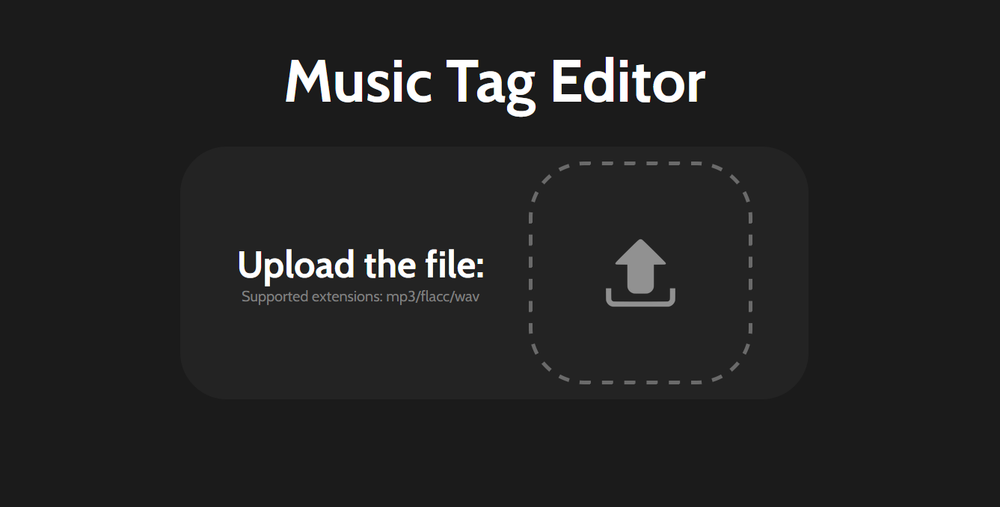

# Music Tag Editor Website



The Music Tag Editor Website is a web application built with SolidJs and utilizes the `browser-id3-writer` npm package to provide users with the ability to edit the metadata (tags) of their music files directly in the browser. This web application allows users to update metadata fields such as Title, Artist, Album, Album Artist, Year, Genre, and Cover Art for their MP3 files in a simple and user-friendly interface.

## Features

- Edit and update metadata/tags of music files (MP3 format) directly in the browser.
- Supported metadata fields: Title, Artist, Album, Album Artist, Year, Genre, and Cover Art.
- Simple and user-friendly interface.

## Requirements

- Node.js (npm) installed on your system.
- Modern web browser that supports ES6 and file APIs.

## Installation

1. Clone the repository from GitHub:

```
git clone https://github.com/your-username/music-tag-editor.git
```

2. Navigate to the project directory:

```
cd music-tag-editor
```

3. Install the required dependencies:

```
npm install
```

## Usage

1. Start the development server:

```
npm run dev
```

2. The application will be accessible at `http://localhost:3000` in your web browser.

3. Click on the "Upload" button to select an MP3 music file from your local system.

4. Once the file is uploaded, the application will display the input forms to change the metadata

5. Edit the metadata fields as needed (Title, Artist, Album, Album Artist, Year and Cover Art).

6. Click on the "Download" button to apply the changes to the music file.

7. The updated music file with new metadata will be available for download.

## Dependencies

The project relies on the following npm packages:

- `solid-js`: A declarative JavaScript library for building user interfaces.
- `browser-id3-writer`: A library to write ID3 metadata tags for MP3 files in the browser.
- Other minor dependencies are listed in the `package.json` file.

## Contributing

Contributions to the Music Tag Editor Website are welcome! If you find any issues or have suggestions for improvements, please feel free to open an issue or create a pull request on the GitHub repository.


## Acknowledgments

- SolidJs community for providing a powerful framework for building reactive web applications.
- browser-id3-writer contributors for enabling ID3 metadata editing in the browser.

## Contact

If you have any questions or need further assistance, you can contact the project maintainers at:

- Email: luisviegasr2@gmail+github.com
- GitHub: [Your GitHub Profile](https://github.com/LuisRamosOfficial)

Thank you for using the Music Tag Editor Website! Happy editing! 🎵🎶